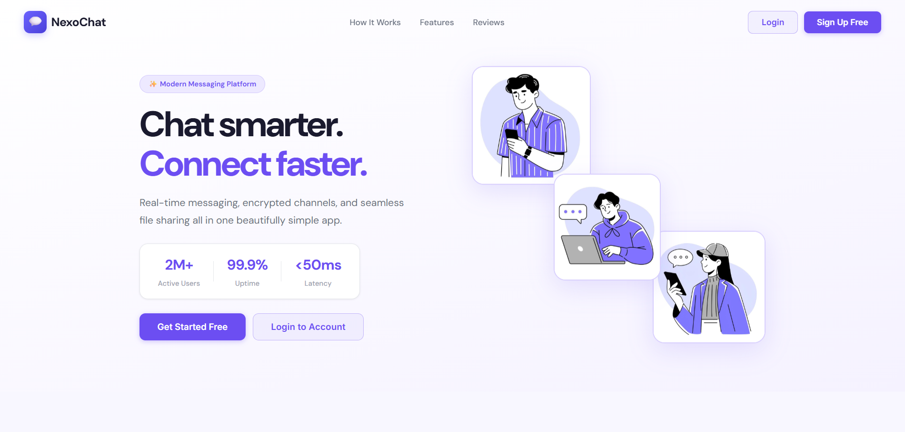
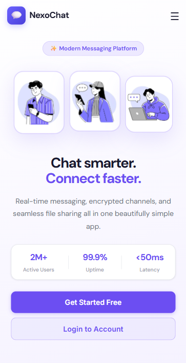

# 💬 NexoChat

### Real-time Chat App — React + Firebase

**Live Demo:** [https://nexochat.netlify.app](https://nexochat.netlify.app)

**GitHub Repository:** [https://github.com/sachin-codes01/NexoChat-ChatApp-](https://github.com/sachin-codes01/NexoChat-ChatApp-)

**NexoChat** is a modern, responsive chat application built with **React**, **Vite**, and **Firebase**. It allows private messaging, group chats, friend requests, and full user account management in a clean, mobile-friendly interface.

---

## Overview

* Real-time private and group chats
* Friend requests and contact management
* User registration, login, email verification, and account deletion
* Fully responsive design for desktop and mobile

**Built with:** React.js, Vite, Firebase Authentication, Firestore, HTML, CSS, JavaScript

---

## Screenshots

<table>
  <tr>
    <td><b>Desktop View</b><br>
        </td>
    <td><b>Mobile View</b><br>
        </td>
  </tr>
</table>

---

## Features

* **Authentication:** Register, login, email verification, delete account
* **Chats:** Private chats, group chats, leave or delete groups
* **Friends & Contacts:** Send and accept friend requests, manage contacts
* **Admin Panel:** Delete any user account (admin only)
* **Responsive Design:** Works on both desktop and mobile
* **Dashboard:** View contacts, groups, and active chats

---

## Tech Stack

* **Frontend:** React.js, Vite, HTML, CSS, JavaScript
* **Backend / Database:** Firebase Authentication & Firestore
* **Hosting:** Netlify

---

## Folder Structure

```
NexoChat/
├── public/
│   ├── PC.png
│   └── Mobile.png
├── src/
│   ├── components/
│   ├── pages/
│   ├── firebase.js
│   └── App.jsx
├── .env
├── index.html
├── package.json
└── vite.config.js
```

---

## Installation & Setup

1. Clone the repository:

```
git clone https://github.com/sachin-codes01/NexoChat-ChatApp-.git
```

2. Navigate into the project folder:

```
cd NexoChat-ChatApp-
```

3. Install dependencies:

```
npm install
```

4. Start the development server:

```
npm run dev
```

Open your browser and go to `http://localhost:5173` to see the app.

---

## Environment Variables

Create a `.env` file in the root directory and add your Firebase configuration:

```
VITE_FIREBASE_API_KEY=your_api_key
VITE_FIREBASE_AUTH_DOMAIN=your_auth_domain
VITE_FIREBASE_PROJECT_ID=your_project_id
VITE_FIREBASE_STORAGE_BUCKET=your_storage_bucket
VITE_FIREBASE_MESSAGING_SENDER_ID=your_sender_id
VITE_FIREBASE_APP_ID=your_app_id
```

---

## Author

**Sachin Kumar**
